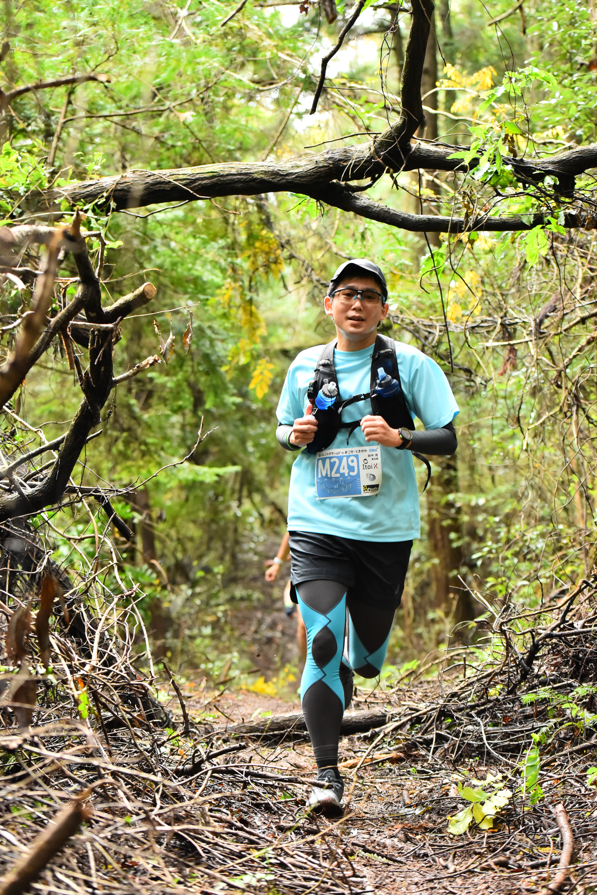
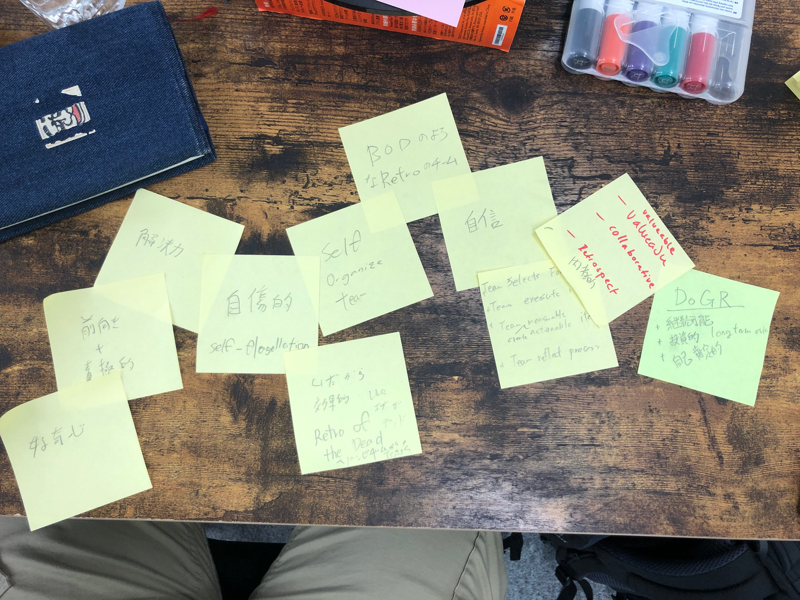
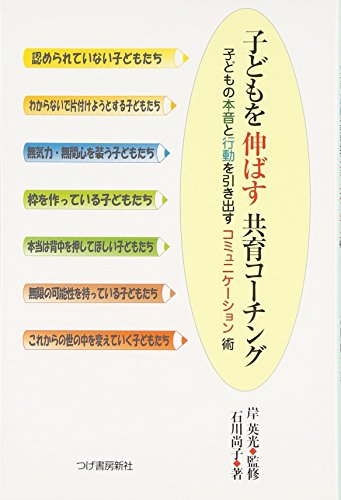
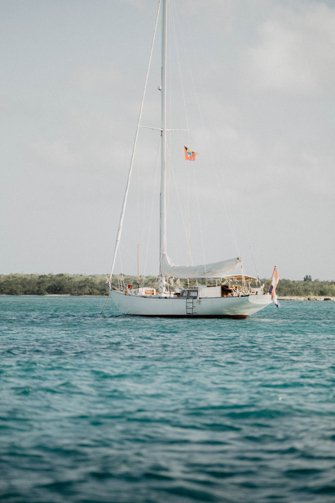
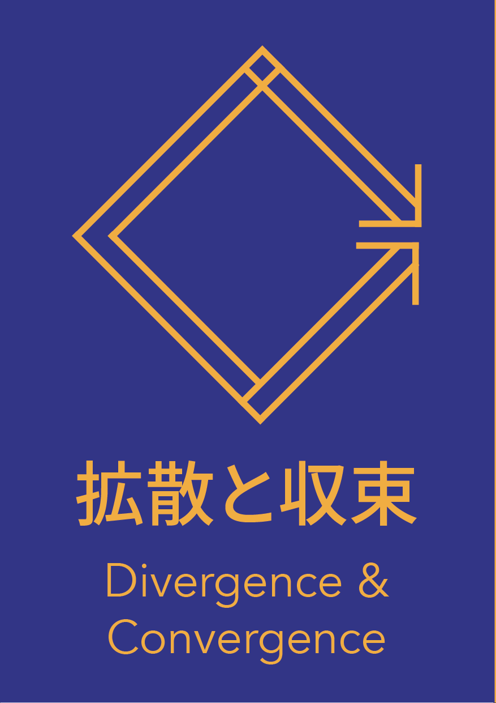

<!-- _backgroundColor: #222 -->
<!-- _color: #888 -->

～ゾンビレトロしてたチームを2年間観察していたら、良い振り返りをするようになったので、その活動報告～

--- 

# 自己紹介
## Ryo Tanaka
### 株式会社 yamaneco
##### Agile Coach / Software Engineer

---

### 好きなもの
- ゲーム（スマブラnon-VIP/テト99VIP）
- アニメ（ケンガン）
- 走る（トレラン・マラソン）
- 数学/量子コンピュータ

---

# Check-In

* 定義(仮)
* 観察記録
* 学びの共有

---
<!-- paginate: true -->
### ある日チームを見ていて気づいた

<!-- _footer: Photo by Simon Wijers on Unsplash -->

---

<!-- _color: white -->
二年前チームはお通夜みたいなレトロをしていました。
ゾンビのようにじっとKPTのPの前に立ち尽くし、30分以上も何もせずに付箋を見続けたまま、Tryアイテムを出さない。やっと書いたかと思ったら、どうやってそれを終わらせるの？といった内容のふわっとした内容でした。すでにタイムボックスは２時間を超えていました。

<!-- _footer: Photo by Daniel Jensen on Unsplash -->

---

現在のチームは、レトロを"randomretros.com" で毎回違うものを選び、新しく出会ったレトロを楽しみながら実行し、次のレトロの改善に向けてのフィードバックを出しつつ、実行可能かつ計測可能なアクションアイテムを出すようになりました。
最初の状況を考えると驚くべき成長です。

<!-- _footer: Photo by Dingzeyu Li on Unsplash -->

---

<!-- background: white -->
# なんでこうなったんだろう？

---

# 定義の話

---

# チームを観察してみる

- チームは良いレトロをしているように見える
- 他のイベント、特にプランニングとかはそこまで良く見えない
- チームがタフで継続的に良くなっていく雰囲気を感じる

---

# チームを観察してみる

- チームは**良いレトロ**をしているように見える
- 他のイベント、特にプランニングとかはそこまで良く見えない
- チームがタフで継続的に良くなっていく雰囲気を感じる

<!--
チームは決してハイパフォーマンスな開発力があるチームではありません。
しかしながらレトロのレベルはかなり高レベルだと感じています。
チームが次のスプリントを終わらせられるかは常に不安定ですが、前向きに成長していっているので、チームが継続していくことをアジャイルコーチとして不安に思うことはありません。
そもそも何をもって私はこのチームが良いレトロをしていると考えたのでしょうか？
-->

---

## なにが**良い**レトロなのか？

Definition of Good Retrospective

---

#### アジャイルコーチやスクラムマスターに聞いてみよう

- 楽しい
- 実験的
- 継続的
- 長期的視野
- 投資的

<!--
何人かのコーチとスクラムマスターからフィードバックを頂き、
このチームのレトロを良いレトロだという感想を得る事が出来ました。
その際、短めの言葉で感想をもらったのですが、
-->

---

### アンチパターンも考えてみる

* 自傷的にチームがチームを良くないと評価し続けていている
* チームで起きた**問題**しか興味がなく、良かったことは良かったね〜だけ。
* とりあえず出てきた、技術的問題にしか興味がない。
* そもそも振り返れない

---

## 遠くが見えている

---

## 遠くが見えている
長期的ゴールと短期的ゴールが完全に乖離している時に、
長期的ゴールに対するアクションがあるといい

---

## 他のコーチからの助言

某コーチ曰く、チームは問題解決を見てはいけない

---
## チームの良い状態

チームが自分のアクションに対して自己肯定的であること

---
## 良いレトロの定義（仮）

- アクションが、実行可能かつ計測可能である
- アクションが長期的なゴールに対する投資
- チームの状態が自己肯定的

自己肯定的チーム = self affirming team

<!--
自己肯定感があるチームは、チームに起きた悪いことも良いことも等しく評価し、過剰にネガティブにもポジティブにもならないようなチームのことです。
-->

---

# 観察記録

---

# 自己肯定的なチームへの兆候

---

# 帆船がきた

<!--_footer: Photo by Ryan Akins on Unsplash-->

---

最初の半年ぐらいは、ずっとKPTをやっていましたが、レトロはあまり機能しませんでした。
そこで、チームに他のレトロをやることを提案しました。
最初にお勧めしたのが、「帆船」レトロです。

「帆船」をやることでチームのレトロの雰囲気はがらりと変わりました。
自由で創造的な雰囲気が生まれたのです。

その後、また半年ほどずっと「帆船」を続けます。

---

# またレトロを変えてみる

チームから「帆船」飽きたっぽい話が出てきました。
ここから定期的にレトロを変えてみるようになりました。ひとで、カーブランドなどなど

---

# レトロは常に変わる

ついにチームは、レトロの開始時にrandomretros.comを使って知らないレトロを引き当てて試すようになりました。

---

## check-in check-outの導入

## check-in:
- 3 words
- 1 words of mood

## check-out:
- amazon rating
- FB to improve the retro

---

# 学びの共有

---

## 文化を変える
チームが大きく躍進したのは、文化に対するアプローチをしたとき

---

## 全部違う
今までやってきた色々なレトロの結果で見える側面はそれぞれ違ったもの

---
## 拡散と収束

レトロの内部で拡散と収束がきちんと行われているときにはいい結果が出ることが多い

---

## 正直さの尊重

---

## 何かをするではなく、何かを変える

---

# まとめ 

* 楽しく！
* チームにあったレトロはチームが知っている
* 出てきたアイテムは終わらせる！

<!--_footer: Photo by Pablo Heimplatz on Unsplash-->

---

contact me @callas1900

